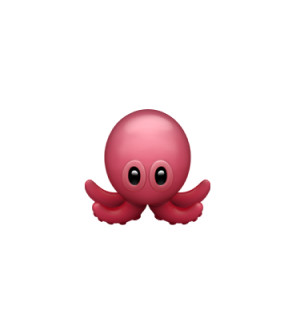

# Css Freamwork OctoCSS 🐙



Un freamwork para componentes ya listos y personalizables al gusto.
Esta rama "main" se encuetra el proyecto de codigo abierto para que
la gente quiera aportar algo, abra actualizaciones sobre los cambio
s y tambien nuevas ramas para cualquier cambio que quieran hacer, el freamwork usa
flexbox principalmente :)

## Card Component

(Se arreglaran errores de tarjeta)
Se crearon componentes tarjeta que funcionan de la siguiente manera:

```html
<div class="card">
  

  <div class="card-body">
    <h1 class="card-title">text</h1>
    <p class="card-text">
      Lorem ipsum, dolor sit amet consectetur adipisicing elit.
      Saepe assumenda nesciunt, ullam neque amet id rem illo
      cupiditate tenetur autem voluptates aperiam.
    </p>
  </div>
</div>
```

## Buttons Components

se van a ir agregando mas botones y componentes mas adelante.

```html
<div class="container__buttons">
  <button class="btn">Click</button>
  <button class="btn btn-dark">Click</button>
  <button class="btn btn-pink">Click</button>
  <button class="btn btn-blue">Click</button>
  <button class="btn btn-green">Click</button>
  <button class="btn btn-orange">Click</button>
  <button class="btn btn-red">Click</button>
</div>
```

# Css FlexBox
Este freamwork esta enfocado en diseños Flexbox. Ofrece clases de utilidad sencillas para crear diseños adaptables rápidamente.

```css
.flex { display: flex; }
.inline-flex { display: inline-flex; }
.flex-row { flex-direction: row; }
.flex-column { flex-direction: column; }
.flex-row-reverse { flex-direction: row-reverse; }
.flex-column-reverse { flex-direction: column-reverse; }
.justify-start { justify-content: flex-start; }
.justify-center { justify-content: center; }
.justify-end { justify-content: flex-end; }
.justify-between { justify-content: space-between; }
.justify-around { justify-content: space-around; }
.justify-evenly { justify-content: space-evenly; }
.items-start { align-items: flex-start; }
.items-center { align-items: center; }
.items-end { align-items: flex-end; }
.items-stretch { align-items: stretch; }
.items-baseline { align-items: baseline; }
.flex-wrap { flex-wrap: wrap; }
.flex-nowrap { flex-wrap: nowrap; }
.flex-wrap-reverse { flex-wrap: wrap-reverse; }
.gap-1 { gap: 5px; }
.gap-2 { gap: 10px; }
.gap-3 { gap: 20px; }
.gap-4 { gap: 40px; }
.flex-1 { flex: 1; }
.flex-2 { flex: 2; }
.flex-auto { flex: auto; }
.flex-none { flex: none; }
.self-start { align-self: flex-start; }
.self-center { align-self: center; }
.self-end { align-self: flex-end; }
.flex-between {
 display:flex;
 justify-content:space-between;
 align-items:center;
}
.flex-space-around {
    display: flex;
    justify-content: space-around;
    align-items: center;
}
```

# Colores de fondo

algunos colores de fondo

```css
.bg-white { background: #ffffff; }
.bg-black { background: #000000; }
.bg-gray { background: #f1f1f1; }
.bg-dark { background: #1a1a1a; }
.bg-blue { background: #3b82f6; }
.bg-red { background: #ef4444; }
.bg-green { background: #22c55e; }
.bg-yellow { background: #eab308; }
```
# Padding simple

Agrege un padding simple

```css
.p-1 { padding: 5px; }
.p-2 { padding: 10px; }
.p-3 { padding: 20px; }
.p-4 { padding: 40px; }
```

# Cambios
se realizaron cambios para agregar cosas utiles

```css
.pt-2 { padding-top: 10px; }
.pb-2 { padding-bottom: 10px; }
.pl-2 { padding-left: 10px; }
.pr-2 { padding-right: 10px; }
.text-white { color: white; }
.text-black { color: black; }
.text-gray { color: gray; }
.text-blue { color: #3b82f6; }
.text-red { color: #ef4444; }
.text-green { color: #22c55e; }
.m-1 { margin: 5px; }
.m-2 { margin: 10px; }
.m-3 { margin: 20px; }
.m-4 { margin: 40px; }
.mt-2 { margin-top: 10px; }
.mb-2 { margin-bottom: 10px; }
.ml-2 { margin-left: 10px; }
.mr-2 { margin-right: 10px; }
.border { border: 1px solid #ddd; }
.border-dark { border: 1px solid #333; }
.border-white { border: 1px solid #ffffff; }
.border-black { border: 1px solid #000000; }
.border-gray { border: 1px solid #9ca3af; }
.border-light { border: 1px solid #e5e7eb; }
.border-none { border: none; }
.text-center { text-align: center; }
.text-left { text-align: left; }
.text-right { text-align: right; }
.rounded { border-radius: 5px; }
.rounded-md { border-radius: 10px; }
.rounded-lg { border-radius: 20px; }
.rounded-full { border-radius: 999px; }
.w-25 { width: 25%; }
.w-50 { width: 50%; }
.w-75 { width: 75%; }
.w-100 { width: 100%; }
.h-25 { height: 25%; }
.h-50 { height: 50%; }
.h-100 { height: 100%; }
```

